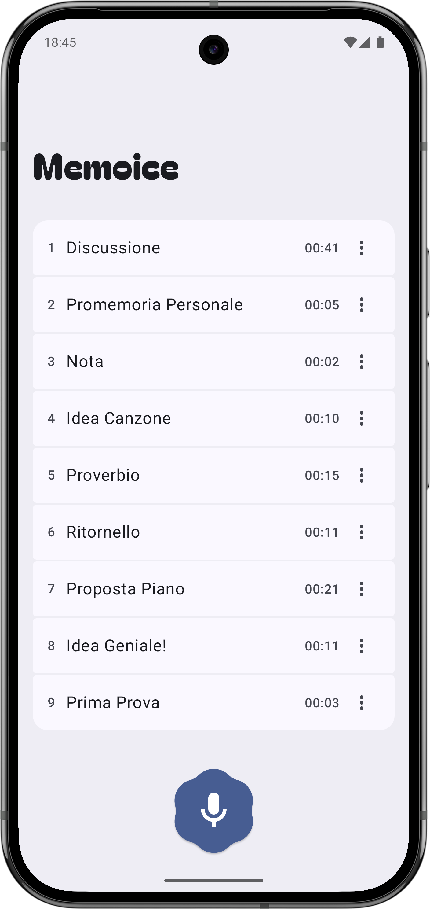
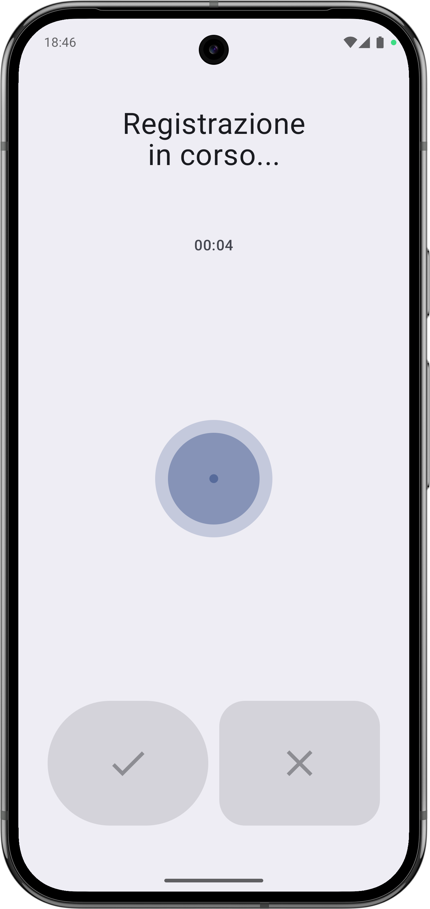
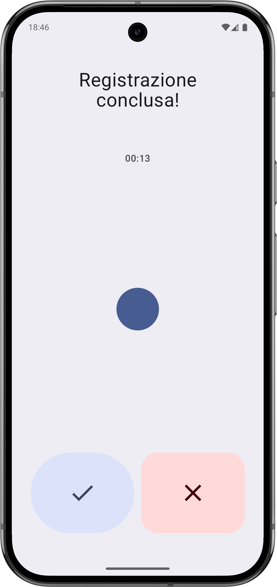
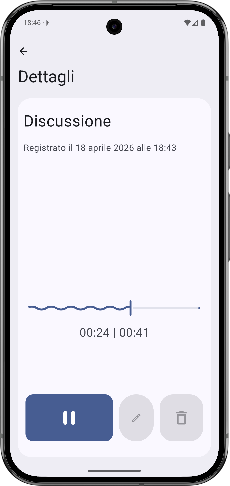

# Memoice

A simple Android app to **create and manage voice memos**, built as a first exploration in Kotlin and Android development.

---

## 🎯 Overview

Memoice was developed for an Embedded Systems exam project at the University of Padua (UNIPD). It demonstrates:

- Jetpack Compose for building the UI  
- Android native audio services for recording and playback  
- Runtime permission handling

---

## 🚀 Features

- Record audio using the device’s microphone  
- Play back memos directly within the app  
- UI designed with Jetpack Compose (using Material 3 / Material 3 Expressive design language)

---

## Preview
<p align="center">
  
  
  
  
</p>


---

## 🛠️ Getting Started

1. Clone the repository:  
   ```bash
   git clone git@github.com:dadebarzan/Memoice.git

